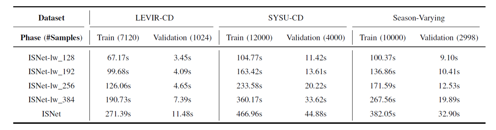

# Code for TGRS article 'ISNet: Towards Improving Separability for Remote Sensing Image Change Detection'.
---------------------------------------------
Here I provide PyTorch implementations for ISNet and ISNet-lw.


## Requirements
>TITAN X<br>
>python 3.6.5<br>
>PyTorch 1.7.0

## Installation
Clone this repo:

```shell
git clone https://github.com/xingronaldo/ISNet.git
cd ISNet/ISNet
```

* Install DCNv2

```shell
cd DCNv2
python setup.py build develop
cd ..
```
**Attention:** GTX/RTX series GPUs may fail to compile DCNv2. TITAN/Tesla series GPUs are recommended.


* Install other dependencies

All other dependencies can be installed via 'pip'.

## Dataset Preparation
Download data and add them to `./datasets`. 

**Note that**

1. The data structure for the Season-Varying dataset has been already given in that folder. The LEVIR-CD dataset and the SYSU-CD dataset share the same data structure. 

2. The instances in original LEVIR-CD dataset are cropped from 1024×1024 to 256×256.


## Test
You can download our pretrained models for LEVIR-CD, SYSU-CD, and Season-Varying from [Baidu Netdisk, code: tgrs](https://pan.baidu.com/s/1DTazE7I3lhELPRZr5oyniQ), [Baidu Netdisk, code: tgrs](https://pan.baidu.com/s/1CDkcUUpdd0w9tz4fe7no0A), and [Baidu Netdisk, code: tgrs](https://pan.baidu.com/s/1rux9Zxjc8yGsga28CSD0kg), respectively. 


Then put them in `./checkpoints/LEVIR-CD/trained_models`, `./checkpoints/SYSU-CD/trained_models`, and `./checkpoints/SV/trained_models`, separately.


* Test on the LEVIR-CD dataset

```python
python test.py --dataset LEVIR-CD --name LEVIR-CD --load_pretrain True --which_epoch 255
```

* Test on the SYSU-CD dataset

```python
python test.py --dataset SYSU-CD --name SYSU-CD --load_pretrain True --which_epoch 57
```

* Test on the Season-Varying dataset

```python
python test.py --dataset SV --name SV --load_pretrain True --which_epoch 194
```

## Train & Validation
```python
python trainval.py --dataset SV --name SV 
```
All the hyperparameters can be adjusted in `./config`.

**logs:**

1. During training, the occupied GPU memory is around **3357MB** when batch size is 8, and around **4101MB** when batch size is 16, on single TITAN X. 

2. **Time** comparison for ISNet and ISNet-lw is given below.

<table cellpadding="0" cellspacing="0" align="center">
  <tr>
    <td  align="center">Time Comparison <br> </td>
  </tr>
</table>


## Supplement
You can download all predictions (in the form of the middle, below) of our ISNet for LEVIR-CD, SYSU-CD, and Season-Varying test sets from [Baidu Netdisk, code: tgrs](https://pan.baidu.com/s/11QsyHkzwlaYGEmlysQL6Uw), [Baidu Netdisk, code: tgrs](https://pan.baidu.com/s/1Wl4Iq_tee3Lhx6pa3FqnXA), and [Baidu Netdisk, code: tgrs](https://pan.baidu.com/s/194O19U0I3Pq766cggjmQTQ), respectively. 

To obtain marked predictions (in the form of the right, below) , use the code in `./ISNet/util/mark_prediction.py`.

<table cellpadding="0" cellspacing="0" align="center">
  <tr>
    <td  align="center">Label <br> </td>
    <td  align="center">Prediction <br> </td>
    <td  align="center">Marked Prediction <br> </td>
  </tr>
</table>

## Citation
@article{Cheng2022ISNet,
title={ISNet: Towards Improving Separability for Remote Sensing Image Change Detection}, 
author={Cheng, Gong and Wang, Guangxing and Han, Junwei},
journal={IEEE Transactions on Geoscience and Remote Sensing}, 
volume={60},
number={},
pages={},
doi={10.1109/TGRS.2022.3174276},
year={2022}
}

## Contact
Don't hesitate to contact me if you have any question.

Email: guangxingwang@mail.nwpu.edu.cn


